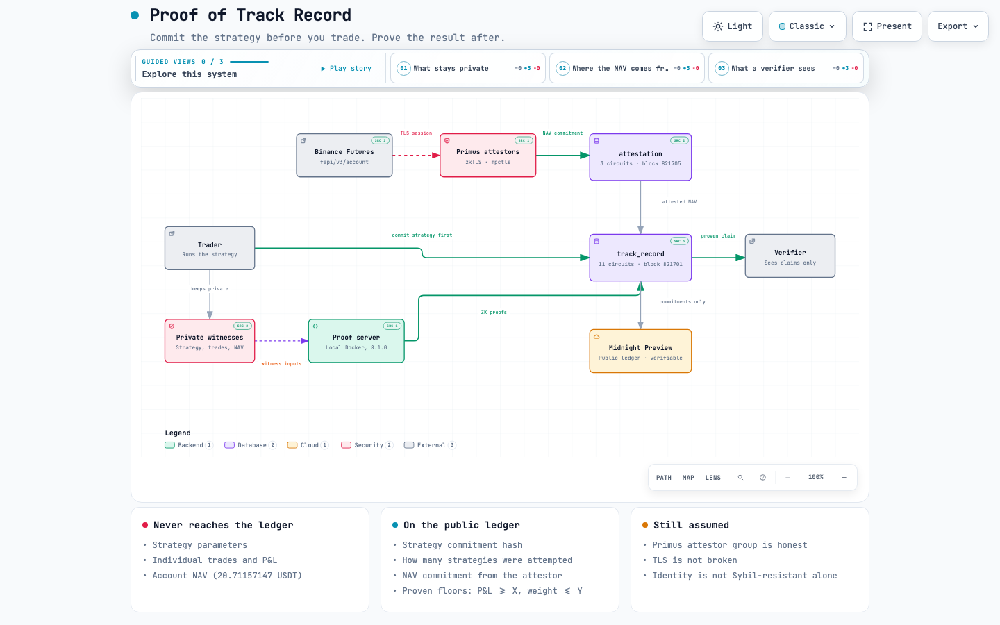

# Proof of Track Record

**[English](README.md)** · 한국어 — Midnight Korea Hackathon 2026


**거래 전에 전략을 커밋한다. 거래 후에 결과를 증명한다. 둘 다 고칠 수 없다.**

거래 내역을 보여주지 않고도 증명할 수 있는 트랙 레코드입니다.

트랙 레코드를 볼 때 보통 *"조작했나?"* 를 묻습니다. 그런데 더 위험한 건 숫자가 전부
진짜인데도 거짓말이 되는 경우입니다. 살아남은 전략만 보여주기 때문입니다.
*"1년 동안 전략 10개를 돌렸다, 이게 그중 제일 잘 된 거다."* 그래서 결과를 알기 **전에**
전략을 온체인에 커밋하고, 나중에 성과가 **그** 커밋에서 나왔음을 증명합니다.
영지식이므로 아무것도 공개되지 않습니다.

저자의 백테스트에서 출발했습니다. **연 23.63%** 가 생존 편향을 제거하자
**14.48%** 로 주저앉았고, 초과수익은 **p = 0.566** 이었습니다. 조작한 것은 없습니다.
파이프라인이 그저 다시 돌릴 수 있었을 뿐이고, 그건 흔적을 남기지 않습니다.

<picture>
  <source media="(prefers-color-scheme: dark)" srcset="diagrams/architecture-dark.png">
  
</picture>

왼쪽 열은 체인에 닿지 않습니다. `diagrams/architecture.html` 은 같은 다이어그램의
자체완결 인터랙티브 버전입니다 — 클론해서 열어보시면 됩니다. 생성 방법과 소스
고정 방식은 [diagrams/](diagrams/) 참고.

## 빠른 시작

```bash
npm install && npm run build     # Compact 툴체인 0.31.1 필요

npm run demo                     # 회로 1-4 + 공격 테스트
npm run nav                      # 회로 5 — 체리피킹 차단
npm run selection                # 회로 6 — 전략 레지스트리
npm run attest                   # 회로 7 — 공증인 슬롯

npm run proof-server             # Docker, 첫 실행 1-2분
npm run live                     # 실제 ZK 증명, 4508 바이트

npm test                         # 28개 — 회로 통과/거부, 단위, 증언 검증
npm run verify                   # 저장된 zkTLS 증언 검증 — 계정 불필요
npm run attest:live              # 새로 하나 만들기 (Primus 자격증명 필요)
npm run attest:onchain           # 그걸 온체인 제출까지 (로컬 devnet, Node 22)
#   --futures 를 붙이면 공개 시세 대신 실제 바이낸스 선물 계좌를 증명합니다
```

## 무엇을 증명하나

| 회로 | 주장 | 막는 것 |
|---|---|---|
| 1 | 거래 전에 전략을 커밋했다 | 전략을 나중에 바꾸기 |
| 2-3 | 수익률이 커밋된 거래 로그에서 나왔다 | 내지 않은 수익률 주장 |
| 4 | 포지션별 리스크 한도를 지켰다 | 리스크 관리 과장 |
| 5 | 수익률이 커밋된 계좌 **NAV** 와 맞는다 | 손실 거래 빼고 계산하기 |
| 6 | **전략을 몇 개 시도했는지**가 공개된다 | 10개 중 1개를 1전 1승처럼 보이기 |
| 7 | NAV 를 제3자가 공증했다 | NAV 자체를 지어내기 |

원장에 올라가는 건 주장뿐입니다 — `손익 하한 800500` 만 남고 실제값 `800590`,
거래 8건, 전략은 전부 비공개입니다.

## 무엇을 증명하지 못하나

ZK 는 **계산이** 정직했음을 증명하지, **입력이** 진짜였음을 증명하지 않습니다.

- **공증인이 정직해야 합니다.** `npm run attest:live` 는
  [Primus](https://primuslabs.xyz) 공증인 네트워크를 통해 실제 zkTLS 세션을
  돌립니다. 공증인이 거래소 엔드포인트를 직접 읽으므로 NAV 는 더 이상 자기
  신고가 아닙니다. 남는 것은 그 공증인 그룹과 TLS 에 대한 신뢰입니다.
  같이 들어 있는 `demoAttestor()` 는 넘겨받은 값을 그대로 공증하며 배선 확인용입니다.
- **시빌 저항은 만드는 게 아니라 상속합니다.** `accountId` 는 `sha256(uid)` 이고,
  그 `uid` 는 잔고와 같은 세션에서 공증인이 거래소로부터 읽습니다. 그래서 API 키를
  새로 발급해도 같은 신원이고, 새 신원은 새 *계정*이어야 합니다. 신원 하나가
  공짜에서 KYC 1회가 됩니다. 거래소 KYC 가 부실하면 그것도 상속합니다.

## 상태

회로 14개(컨트랙트 2개), 실제 ZK 증명, Primus 공증인 네트워크를 통한 바이낸스 선물
계좌의 **실제 zkTLS 공증**, 그리고 두 컨트랙트 모두 Midnight **Preview 테스트넷**에
배포 — 누구나 검증할 수 있습니다.

```
블록 821701  track_record 배포
블록 821705  attestation 배포
블록 821911  registerAttestor
블록 821915  submitAttestation   <- NAV 커밋 (NAV 값은 비공개)
블록 821919  proveAttestedNav    <- ZK 증명
```

| | |
|---|---|
| [동기와 선행 연구](docs/motivation.ko.md) | 인증만으로 왜 부족한가, Obscura·Proof of Alpha·ZEROBASE 와의 비교 |
| [신뢰 모델](docs/trust-model.ko.md) | 각 회로가 막는 것, 공증인 슬롯, 되돌린 Schnorr 시도 |
| [구현 노트](docs/implementation.ko.md) | Midnight 기능 매핑, `disclose()` 가 잡아낸 것, 배포, 실제 포트폴리오 증명, 전체 스크립트 표 |

배경: [Algorithmic_Trading_YL](https://github.com/SeoDongOk/Algorithmic_Trading_YL)
· [생존 편향이 알파를 지운 과정](https://seodongok.github.io/blog/2026-09-08-survivorship-bias-kills-alpha)

Apache-2.0 — [LICENSE](LICENSE) 참고.
